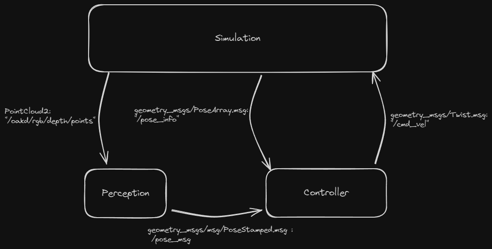

# Perception and Controller

## Introduction

This project is developed on ROS 2 (Robot Operating System 2) for a car simulation. Its main objective is to address the complex environmental factors encountered by vehicles during real-world journeys and generate appropriate responses to these factors.

The main components of the project are as follows:

1. **Image Capture**: Continuous images are captured from the simulation environment. These images are used to analyze the road and surroundings.

2. **Perception Algorithm**: The images are processed through a perception algorithm. This algorithm detects lanes on the road and helps determine the vehicle's position.

3. **Lane Detection and Waypoint Generation**: A suitable waypoint is generated from the detected lanes. This waypoint is used to ensure the safe travel of the vehicle.

4. **Control Algorithm**: The generated waypoint is processed by a control algorithm. This algorithm ensures that the vehicle stays on the path, enabling it to reach its destination safely.

The project is designed to simulate real-world scenarios and aims to contribute to the development of autonomous vehicle technology.

## Table of Contents
- [Perception and Controller](#perception-and-controller)
  - [Introduction](#introduction)
  - [Table of Contents](#table-of-contents)
  - [Objectives](#objectives)
  - [Files](#files)
  - [Perception](#perception)
    - [Trained model](#trained-model)
    - [Guide to Fill in the `evaluate` Function](#guide-to-fill-in-the-evaluate-function)
      - [Instructions:](#instructions)
      - [Notes:](#notes)
  - [Control](#control)
    - [Requirements:](#requirements)
    - [Instructions:](#instructions-1)
    - [Notes:](#notes-1)
  - [Communication Graph](#communication-graph)


## Summary of Task List
Here are your tasks to do.
* [Training the Model](#Training-the-Model)
* [Guide to Fill in the `evaluate` Function](#guide-to-fill-in-the-evaluate-function)
* [Control](#control)


## Files
Overview of files.
```python
├── package.xml
├── Perception
│   ├── dataset_creator.py
│   ├── __init__.py
│   ├── model
│   │   ├── __init__.py
│   │   └── unet.py
│   ├── README.md
│   ├── train.py
│   ├── evaluate.py
│   └── utils
│       ├── dataloader.py
│       ├── __init__.py
│       ├── loses.py
│       └── utils.py
├── perception_and_controller
│   ├── controller.py
│   ├── __init__.py
│   ├── perception.py
│   └── rotation_utils.py
├── README.md
├── graph.png
├── resource
│   └── perception_and_controller
├── setup.cfg
├── setup.py
```
## Perception

The Perception package plays a crucial role in the image processing pipeline of the project. It is responsible for segmenting the captured images and extracting lane segmentation. By providing segmented lanes as output, this package enables the system to understand the layout of the road and the vehicle's position relative to it. In our case the `perception.py` script utilizes your trained model and the `evaluate` function to create segmented lane from the image, extracts waypoint from segmented image and sending waypoint to the controller for the vehicle to follow accurately. The model used in `perception.py` is the one developed in our [previous homework.](https://github.com/MrSkyGodz/Perception-Project)

### Training the Model

You will have to train the `Unet` model given previous homework and you can use the previously trained model file or you can train a new one. Inside the [***perception.py***](perception_and_controller/perception.py) script, the `Perception` class has the `trained_model` parameter that will take your trained model file path. 

### Guide to Fill in the `evaluate` Function

In this task, you are expected to fill in the [***evaluate***](https://github.com/MrSkyGodz/Perception-Project/blob/main/evaluate.py) function provided to you. This function is designed to process an input image and extract segmented lanes from it. 

#### Instructions:

1. **Take the Image and Model:**
    - The function takes an image and [***model***](https://github.com/MrSkyGodz/Perception-Project/blob/main/model/unet.py) as a parameter. This image will be a frame captured by the vehicle's camera.

2. **Perform Segmentation:**
    - Perform a segmentation process on the input image. You are expected to use a model that was given as a `parameter` to perform this segmentation.

3. **Return the Output:**
    - Finally, return the extracted segmented lanes as output. This output will be used by the controller part to guide the vehicle's motions.

#### Notes:
- You can use the previous homework or design a new one.


## Control
The controller part of this project has not been implemented yet. In this section, you are expected to develop a ROS node that will receive information by listening to the `/pose_msg` topic published by the [***perception.py***](perception_and_controller/perception.py) script. The purpose of this controller is to track a given pose based on the received information and publish `/cmd_vel` topic to simulation for control the car. For this purpose, you are expected to fill the [***controller.py***](perception_and_controller/controller.py).

### Requirements:

1. **ROS Node:** Develop a ROS node responsible for controlling the autonomous vehicle.

2. **Input Topics:** Subscribe to the `/pose_msg` topic with `geometry_msgs/msg/PoseStamped.msg` to receive tracked pose information published by the perception module. Subscribe to the `/pose_info` topic with `geometry_msgs/PoseArray.msg` to receive car pose information published by the simulation. (Pose of the car is the first index of the `PoseArray` message)

3. **Output:** Implement control logic based on received pose information to guide the vehicle and publish to `/cmd_vel` topic with `geometry_msgs/Twist.msg`.

### Instructions:

1. **Create a ROS Node:** Begin by creating a new ROS node specifically for controlling the vehicle. This node will handle the incoming pose messages and generate control commands accordingly.

2. **Subscribe to Pose Messages:** Ensure that your node subscribes to the `/pose_msg` topic to receive pose information from the perception module.

3. **Implement Control Logic:** Develop the logic necessary to interpret the pose information and generate control commands to steer the vehicle towards the desired pose.

4. **Testing:** Test your controller node in conjunction with other modules of the project to ensure proper integration and functionality.

5. **Documentation:** Document your code thoroughly, including explanations of key functions and algorithms used in the control logic.

### Notes:

- Ensure that your controller node efficiently processes pose information and generates appropriate control commands to ensure smooth and accurate vehicle movement.

## Communication Graph

